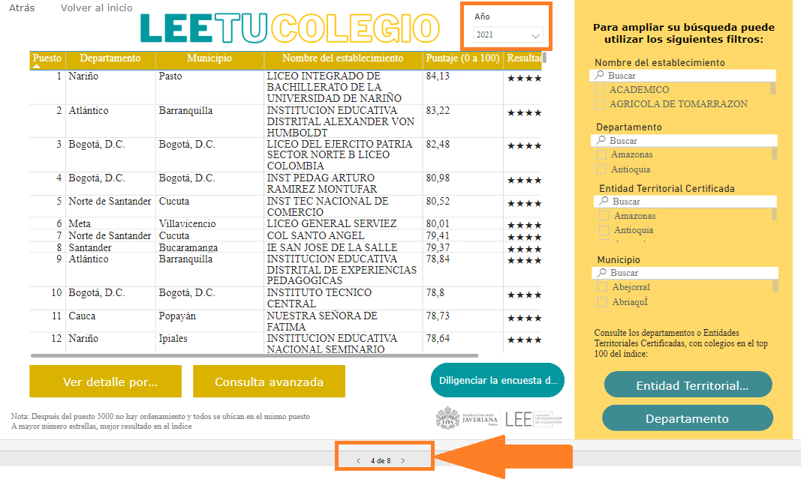

# SCRAPEAR_LEE

Hace un tiempo necesité extraer esta información para usarla en un modelo de evaluación de impacto de un programa educativo y me dio mucha pereza hacerlo de manera manual. Con este código, en 10 minutos pude extraer datos de más de 5.000 colegios.

Este proyecto contiene un script en Python que permite extraer de manera masiva la información de la página 4 del tablero de Power BI, donde se encuentra el cálculo del índice multidimensional que evalúa las instituciones de educación, publicado por el Laboratorio de Economía de la Educación (LEEE). La información incluye los datos de los primeros 5 mil colegios de Colombia, aunque algunos de ellos no registran puntaje.

Despues de ejecutar el get driver (La segunda celda), de manera manual se puede determinar la página 4 y el año del que se desean los datos 2021, 2022 o 2023.

## Requisitos
Para poder ejecutar este script, necesitas tener instalados los siguientes programas y bibliotecas:
- Python 3.x
- Bibliotecas de Python:
  - `requests`
  - `BeautifulSoup`
  - `pandas`
  - `selenium`
  - `openpyxl`
 
 **Configuración del Web Scraper:**
- Abre el archivo `config.py` (o el archivo de configuración correspondiente) y asegúrate de que los parámetros estén configurados correctamente.
- Asegúrate de tener el navegador web compatible y el controlador (driver) de Selenium. Por ejemplo, para Chrome necesitarás [ChromeDriver](https://sites.google.com/a/chromium.org/chromedriver/).
- El codigo simula la mano humana al hacer scroll en la tabla del tablero publicado en su página 4, por tanto durante 10 min no se podrá hacer otra actividad.
